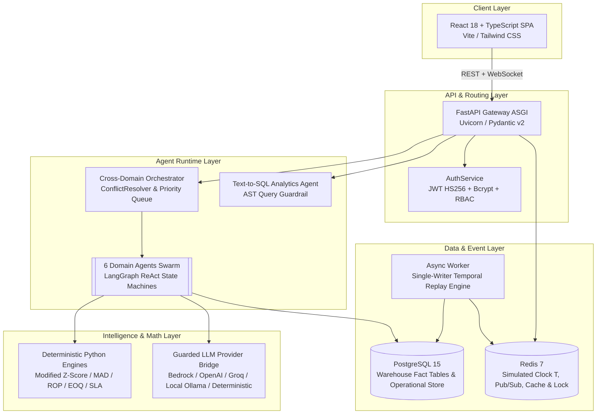

<div align="center">

# ⚡ CommerceOS
### Autonomous Multi-Agent Operating System for Intelligent E-Commerce Operations & Supply Chain Resilience

[](https://fastapi.tiangolo.com)
[](https://react.dev)
[](https://www.typescriptlang.org)
[](https://www.python.org)
[](https://langchain-ai.github.io/langgraph/)
[](https://www.postgresql.org)
[](https://redis.io)
[](https://www.docker.com)
[](https://opensource.org/licenses/MIT)

<p align="center">
  <b>CommerceOS</b> replaces fragmented, manual e-commerce administration and static ERP dashboards with an autonomous swarm of collaborative AI agents. Grounded on authentic enterprise transaction data (100k+ orders), CommerceOS continuously audits fulfillment pipelines, predicts inventory stockouts, optimizes pricing margins, resolves cross-domain operational conflicts, and enforces human-in-the-loop financial governance.
</p>

[Key Features](#-specialized-agent-swarm) • [Architecture](#-system-architecture) • [SLA Monitoring](#-sla--delivery-promise-monitoring) • [Datasets](#-datasets--temporal-replay-engine) • [Installation](#-getting-started) • [Environment Variables](#-environment-variables) • [Default Credentials](#-default-credentials) • [API Reference](#-api-reference) • [Mathematical Formulations](#-mathematical-formulations--statistical-profiling) • [Tech Stack](#-tech-stack)

---

</div>

## 📌 Executive Summary

Modern enterprise e-commerce platforms suffer from acute administrative fragmentation: fulfillment bottlenecks, carrier delivery delays, stockout penalties, and price discount leakage are manually reviewed across siloed spreadsheets and static dashboards. 

**CommerceOS** introduces a paradigm shift from **reactive, human-dependent monitoring** to **proactive, autonomous operations**:
- **Zero Calculative Hallucinations:** Large Language Models (LLMs) are restricted strictly to natural language intent triage, entity extraction, and conversational synthesis. All arithmetic, forecasting, statistical anomaly detection, and database mutations are executed exclusively by deterministic Python engines and SQL aggregations.
- **Continuous Temporal Simulation:** A Redis-locked monotonic simulated clock streams real historical logs with zero temporal lookahead leakage.
- **Cross-Domain Orchestration:** A centralized coordinator correlates risk across functional units (e.g., automatically throttling marketing discount campaigns on items currently facing critical inventory stockouts).
- **Human-in-the-Loop (HITL) Governance:** High-risk financial operations (bulk refunds, purchase orders, price markdowns) are queued into an administrative authorization pipeline governed by Role-Based Access Control (RBAC).

---

## 🤖 Specialized Agent Swarm

CommerceOS coordinates **six domain agents**, **one centralized orchestrator**, and **one text-to-SQL analytics agent**:

| Agent | Core Responsibilities | Key Capabilities |
| :--- | :--- | :--- |
| **📦 Orders Operations Agent** | Fulfillment pipelines, backlog aging & return adjudication | Evaluates delay rates across 13,000+ orders; tracks multi-carrier shipment milestones (`[PLACED]` &rarr; `[IN_TRANSIT]` &rarr; `[DELIVERED]`); enforces algorithmic 30-day RMA return policies without false positives. |
| **🛡️ Smart Inventory Watchdog** | Stockout prevention & automated replenishment | 24/7 autonomous guardian evaluating 11,000+ SKUs; dynamically calculates Reorder Points (ROP) based on lead time variance; generates Economic Order Quantity (EOQ) batch purchase orders. |
| **🚚 Logistics & Dispatch Agent** | Carrier performance & lane transit reliability | Monitors carrier transit SLAs; calculates lane transit distributions; identifies regional bottleneck states and computes late-delivery risk probability scores. |
| **💰 Dynamic Pricing Agent** | Margin protection & discount leakage control | Identifies loss-making transactions; detects discount leakage; audits freight cost drag and generates markdown vs. margin trade-off recommendations. |
| **📈 Marketing Intelligence Agent** | Customer segmentation & campaign orchestration | Computes Recency, Frequency, Monetary (RFM) customer segmentations; tracks customer repeat rates and triggers automated retention campaign plays. |
| **💬 Customer Support Agent** | Multi-intent inquiry triage & dispute resolution | Conversational assistant handling tracking status, cancellation requests, and RMA authorizations; maintains long-term customer profile memory. |
| **⚡ Cross-Domain Orchestrator** | Systemic risk synthesis & conflict resolution | Runs parallel domain sweeps; identifies opposing agent objectives (e.g., Marketing promotion vs. Inventory stockout); executes deterministic priority arbitration. |
| **🔍 Text-to-SQL Analytics Agent** | Natural language ad-hoc warehouse querying | Converts natural language questions into safe SQL; utilizes AST (Abstract Syntax Tree) validation to restrict execution to read-only `SELECT`/`WITH` queries. |

---

## 🏗️ System Architecture

CommerceOS is engineered on a decoupled, microservices-based event-driven architecture adhering to the C4 software design methodology:



### The ReAct Execution Loop
Every domain agent runs a cyclic `langgraph.StateGraph` state machine:
```text
Observe (Live DB @ Clock T)
  → Triage Intent & Parameters (Guarded LLM / Sanitized)
  → Execute Deterministic Tools (SQL Aggregations / Anomaly Profilers)
  → Detect Outliers (Modified Z-Score, MAD, Tukey Fences)
  → Assess Risk & Assign Statistical Confidence (HIGH / MEDIUM / LOW)
  → Classify Action Mode (AUTO / NEEDS_APPROVAL / BLOCKED)
  ↺ Bounded Self-Correction Loop (≤ 3 iterations)
  → Persist AgentRun & Findings, Broadcast WebSocket Event
```

---

## ⏱️ SLA & Delivery Promise Monitoring

CommerceOS features an empirical **Service Level Agreement (SLA)** monitoring subsystem ([`backend/app/services/sla_service.py`](file:///d:/nexusHackathon/nexus/CommerceOS/backend/app/services/sla_service.py)):

- **Strict Zero-Fabrication Scope:** Evaluates only delivered orders with *both* an actual customer delivery date and an estimated promised delivery date (`WHERE timestamp <= T`).
- **Delivery Margin Formula:**
  $$\text{margin\_days} = \frac{\text{delivered\_timestamp} - \text{promised\_timestamp}}{86,400\text{ seconds}}$$
  - **On-Time (Compliant):** $\text{margin\_days} \le 0$
  - **Delayed (SLA Breach):** $\text{margin\_days} > 0$
  - **Critical SLA Breach:** $\text{margin\_days} > 7.0\text{ days}$
- **Interactive UI Dashboard ([`SlaDashboard.tsx`](frontend/src/analytics/SlaDashboard.tsx)):** SLA compliance KPIs, delay histograms (1–3 days, 3–7 days, 7–14 days, 14+ days), monthly trend, worst-state / worst-seller / worst-category tables, and critical-breach order tables.
- **Filters:** purchase-date range, customer state, seller, and product category (English labels) — every panel recomputes over the same filtered slice.
- **Support response (observed only):** review-answer latency is reported as an observed distribution; the Olist dataset contains **no contractual support-SLA dates**, so no pass/fail rate is claimed.
- **Refunds vs deadlines: unavailable** — the dataset records cancellations but no refund amounts; the dashboard states this rather than estimating.
- **API:** `GET /api/v1/analytics/sla?start=&end=&state=&seller=&category=`

---

## 💼 Business Impact Estimation

A companion dashboard ([`ImpactDashboard.tsx`](frontend/src/analytics/ImpactDashboard.tsx), powered by [`impact_service.py`](backend/app/services/impact_service.py)) attaches real order values to the delays the SLA monitor finds:

- **Affected Order Value** = $\sum (\text{item price} + \text{freight})$ over delayed orders (actual dataset values).
- **Affected Customers** = count of *unique* customers on delayed orders (deduplicated — never double-counted).
- **Average Order Value (delayed vs on-time)** = total order value ÷ orders, computed separately for each cohort.
- **Impact slices:** affected value by seller, product category, customer state, and purchase month; plus a high-impact order table (largest delayed orders by value).
- **Strict labeling:** the same figure appears as *Affected Order Value* and *Estimated Revenue Exposure* (value at risk), while **Actual Lost Revenue is always reported as `UNAVAILABLE`** — the dataset carries no refund, penalty, or margin data, so no loss is ever claimed from a delay alone.
- **Value coverage:** delayed orders lacking order-item rows are excluded from value figures and reported as a coverage gap — never counted as zero-value.
- **API:** `GET /api/v1/analytics/impact?start=&end=&state=&seller=&category=`

---

## 📊 Datasets & Temporal Replay Engine

CommerceOS operates over two massive, authentic enterprise e-commerce datasets:

1. **Brazilian Olist E-Commerce Dataset:** ~100,000 commercial orders (2016–2018) spanning customers, sellers, products, geolocation, payments, order reviews, and category translations.
2. **DataCo Global Smart Supply Chain Dataset:** ~180,000 records detailing international multi-carrier freight lanes, scheduled shipping days, real shipping days, delivery risk tags, and order profit margins.

### Deterministic Replay Engine
- Rather than running static, retrospective analyses, CommerceOS features a single-writer replay worker ([`app/services/replay_engine.py`](file:///d:/nexusHackathon/nexus/CommerceOS/backend/app/services/replay_engine.py)).
- An authoritative **monotonic simulated clock $T$** is maintained in Redis.
- Every analytical query and agent observation strictly enforces:
  ```sql
  WHERE order_purchase_timestamp <= :simulated_clock
  ```
- This guarantees **zero lookahead temporal data leakage**, perfectly replicating the experience of running a live store in real-time.

---

## 🧮 Mathematical Formulations & Statistical Profiling

All analytical indicators in CommerceOS are computed by deterministic mathematical engines:

### 1. Robust Anomaly Detection (Modified Z-Score & MAD)
Standard Z-Scores fail in e-commerce due to extreme outlier volumes. CommerceOS implements the Boris Iglewicz and David Hoaglin formulation using Median Absolute Deviation (MAD):
$$\text{MAD} = \text{median}\left(|x_i - \tilde{x}|\right)$$
$$M_i = \frac{0.6745 \cdot (x_i - \tilde{x})}{\text{MAD}}$$
*An event is flagged as anomalous when $|M_i| \ge 3.0$.*

### 2. Dynamic Inventory Reorder Point (ROP)
$$\text{ROP} = \text{Lead Time Demand} + \text{Safety Stock}$$
$$\text{ROP} = (\bar{d} \cdot L) + \left(Z \cdot \sigma_d \cdot \sqrt{L}\right)$$
- $\bar{d}$: Average daily sales demand
- $L$: Upstream supplier lead time in days
- $Z$: Service factor ($Z = 1.65$ for 95% service level)
- $\sigma_d$: Standard deviation of daily demand

### 3. Economic Order Quantity (EOQ)
$$\text{EOQ} = \sqrt{\frac{2 \cdot D \cdot S}{H}}$$
- $D$: Annual units demand
- $S$: Fixed purchase order placement cost
- $H$: Holding / carrying cost per unit per year

---

## 🛠️ Tech Stack

| Domain | Technology / Library | Purpose |
| :--- | :--- | :--- |
| **Backend Framework** | [FastAPI 0.110+](https://fastapi.tiangolo.com/) | High-speed, asynchronous ASGI REST & WebSocket host |
| **Agent Orchestrator** | [LangGraph](https://langchain-ai.github.io/langgraph/) & [LangChain Core](https://python.langchain.com/) | Cyclic ReAct state machines and tool dispatching |
| **Language & Engine** | Python 3.11+ | Primary backend programming environment |
| **Database & ORM** | [PostgreSQL 15](https://www.postgresql.org/) & [SQLAlchemy 2.0](https://www.sqlalchemy.org/) | Relational warehouse and operational ACID persistence |
| **Schema Migrations** | [Alembic](https://alembic.sqlalchemy.org/) | Version-controlled database schema management |
| **Cache & Event Bus** | [Redis 7](https://redis.io/) (ElastiCache compatible) | Thread-safe clock state, rate-limiting, and WebSocket fan-out |
| **Frontend Framework**| [React 18](https://react.dev/) & [TypeScript 5.6](https://www.typescriptlang.org/) | Strict-typed single page application (SPA) |
| **Build & Styling** | [Vite](https://vitejs.dev/) & [Tailwind CSS](https://tailwindcss.com/) | High-performance bundling and responsive styling |
| **Icons & Charts** | [Lucide React](https://lucide.dev/) & Canvas Charts | High-density enterprise operational dashboards |
| **Document Engine** | [ReportLab](https://www.reportlab.com/) | In-memory dynamic encrypted PDF invoice generation |
| **Security & Auth** | `bcrypt` & `python-jose` | Salted password hashing and stateless JWT bearer tokens |
| **Infrastructure** | Docker, Docker Compose, Terraform | Multi-stage container builds and AWS cloud IaC |

---

## 📁 Repository Structure

```text
CommerceOS/
├── backend/
│   ├── alembic/                 # Database schema migrations
│   ├── app/
│   │   ├── agents/              # Domain agents (orders, inventory, logistics, pricing, etc.)
│   │   ├── analytics/           # Text-to-SQL analytics agent
│   │   ├── api/                 # FastAPI routers, middleware, and dependencies
│   │   ├── automation/          # HITL policy engine and action executors
│   │   ├── core/                # Settings, security, and structured JSON logging
│   │   ├── database/            # SQLAlchemy session factory and connection pooling
│   │   ├── intelligence/        # Anomaly detectors, statistics, and forecasting models
│   │   ├── models/              # SQLAlchemy database models (warehouse + operational)
│   │   ├── orchestrator/        # Cross-domain coordinator and conflict resolver
│   │   └── services/            # Multi-provider LLM bridge, SLA service, replay engine
│   ├── data/raw/                # Olist and DataCo historical CSV sources
│   ├── scripts/                 # Warehouse builders and user seeding scripts
│   ├── tests/                   # Pytest test suite (55+ tests)
│   ├── Dockerfile               # Production multi-stage backend container
│   └── requirements.txt         # Pinned Python production dependencies
├── frontend/
│   ├── src/
│   │   ├── analytics/           # SLA and operational analytics dashboards
│   │   ├── auth/                # JWT authentication context and route guards
│   │   ├── pages/               # Enterprise login, agent views, and command center
│   │   ├── App.tsx              # Root navigation and 8-tab operational switcher
│   │   └── config.ts            # API routes and WebSocket endpoints
│   ├── Dockerfile               # Multi-stage frontend container with Nginx
│   └── package.json             # Frontend React dependencies
├── docs/                        # Architecture specs, DB schemas, and Capstone Report
├── infra/aws/                   # AWS Terraform modules (ECS, RDS, Redis, ALB, CloudFront)
├── docker-compose.yml           # Full-stack containerized local and cloud deployment
├── run_backend.py               # Uvicorn backend runner
├── start_backend.bat            # 1-click Windows backend launcher
└── start_frontend.bat           # 1-click Windows frontend launcher
```

---

## 🚀 Getting Started

### Prerequisites
- **Python 3.11+**
- **Node.js 18+** & **npm**
- *(Optional)* **Docker & Docker Compose**

---

### Option 1: One-Click Quickstart on Windows (Recommended)

1. **Launch Backend:**  
   Double-click `start_backend.bat` (or run in PowerShell):
   ```powershell
   python run_backend.py
   ```
   - REST API available at: **`http://127.0.0.1:8000`**
   - Interactive Swagger docs: **`http://127.0.0.1:8000/docs`**

2. **Launch Frontend:**  
   Double-click `start_frontend.bat` (or run in PowerShell):
   ```powershell
   cd frontend
   npm install
   npm run dev
   ```
   - Dashboard running at: **`http://localhost:3000`**

---

### Option 2: Docker Compose (Full Stack)

Run the full production stack including PostgreSQL, Redis, backend, worker, and frontend:
```bash
docker compose up -d --build
```
- Web Application: **`http://localhost:3000`**
- API & Docs: **`http://localhost:8000/docs`**

---

## ⚙️ Environment Variables

Copy `backend/.env.example` to `backend/.env` to configure runtime parameters:

| Variable | Default Value | Description |
| :--- | :--- | :--- |
| `ENVIRONMENT` | `dev` | Application profile (`dev`, `test`, `prod`). |
| `DATABASE_URL` | `sqlite:///./orders.db` | SQLAlchemy connection string (PostgreSQL or SQLite). |
| `REDIS_URL` | `redis://localhost:6379/0` | Redis connection for clock synchronization and pub/sub. |
| `REDIS_ENABLED` | `false` | Enables Redis event bus (falls back to in-memory if false). |
| `AUTH_ENFORCED` | `false` | When `true`, enforces strict JWT verification on every API route. |
| `JWT_SECRET` | `dev-insecure-secret-...` | Secret key used for signing JWT authentication tokens. |
| `LLM_PROVIDER` | `auto` | Provider (`auto`, `openai`, `groq`, `anthropic`, `bedrock`, `deterministic`). |
| `OPENAI_API_BASE` | *(Empty)* | Compatible endpoint (supports local Ollama or GLM-4 / Zhipu). |
| `OPENAI_API_KEY` | *(Empty)* | API key for OpenAI or OpenAI-compatible model endpoints. |
| `GROQ_API_KEY` | *(Empty)* | API key for Groq high-speed inference. |
| `SIMULATED_CLOCK_START` | `2016-09-04T00:00:00`| Initial start timestamp for the temporal replay engine. |

---

## 🔐 Default Credentials

CommerceOS is pre-seeded with dedicated Role-Based Access Control (RBAC) accounts:

| Username | Assigned Role | Permissions & Scope | Default Password |
| :--- | :--- | :--- | :--- |
| **`admin`** | **Super Admin** | Full platform authority across all agents, HITL approvals, and audit logs | `CommerceOS2026!` |
| **`orders_admin`** | **Orders Admin** | Pipeline auditing, fulfillment tracking, backlog oversight, and RMAs | `CommerceOS2026!` |
| **`inventory_admin`**| **Inventory Admin**| Catalog monitoring, stockout alerts, ROP/EOQ, and restocking POs | `CommerceOS2026!` |
| **`logistics_admin`**| **Logistics Admin**| Carrier SLA monitoring, transit distributions, and lane risk analysis | `CommerceOS2026!` |
| **`pricing_admin`** | **Pricing Admin** | Catalog pricing benchmarks, margin leak detection, and markdowns | `CommerceOS2026!` |
| **`marketing_admin`**| **Marketing Admin**| RFM cohort segmentation, customer retention, and campaign controls | `CommerceOS2026!` |
| **`support_admin`** | **Support Admin** | Customer message triage, tracking inquiries, and dispute resolution | `CommerceOS2026!` |

---

## 📡 API Reference

Interactive OpenAPI documentation is automatically served at **`/docs`** or **`/redoc`**. Key endpoints:

### Authentication & System
- `POST /api/v1/auth/login` — Issues authenticated JWT bearer token.
- `GET /api/v1/auth/me` — Returns active user profile and assigned RBAC role.
- `GET /health` & `GET /health/ready` — Comprehensive database and infrastructure healthchecks.
- `GET /api/v1/system/status` — Returns live LLM provider, auth mode, and database dialect.

### Domain Agents & Orchestration
- `POST /api/v1/agents/orders/analyze` — Triggers full empirical orders pipeline audit.
- `POST /api/v1/agents/orders/query` — Natural language ReAct conversational query for orders.
- `GET /api/v1/agents/inventory/monitor` — Runs stock watchdog, computes ROP and stockout risks.
- `POST /api/v1/agents/logistics/analyze` — Audits carrier transit times and late-delivery risks.
- `POST /api/v1/agents/pricing/analyze` — Evaluates order lines for negative margins and freight drag.
- `POST /api/v1/agents/marketing/analyze` — Generates RFM customer segmentation distributions.
- `POST /api/v1/orchestrator/run` — Executes cross-domain sweep, resolves conflicts, and sets action queue.
- `GET /api/v1/orchestrator/latest` — Fast cached read of the latest orchestration decision.

### Human-in-the-Loop (HITL) Automation & Approvals
- `GET /api/v1/automation/approvals` — Lists pending, approved, and rejected high-risk actions.
- `POST /api/v1/automation/approvals/{id}/approve` — Authorizes and executes queued action (RBAC restricted).
- `POST /api/v1/automation/approvals/{id}/reject` — Rejects queued action and logs decision reason.

### Operations Analytics & WebSockets
- `GET /api/v1/analytics/sla` — SLA & delivery-promise compliance: monitored/on-time/delayed counts, compliance %, delay rate, avg/median/P90 delay, delay buckets, monthly trend, state/seller/category breakdowns, critical delayed orders, support-response stats. Filters: `start`, `end`, `state`, `seller`, `category`.
- `GET /api/v1/analytics/impact` — Business impact estimation: affected order value, affected customers, revenue exposure, AOV delayed-vs-on-time, exposure by seller/category/state/month, top impacted orders. Same filters.
- `GET /api/v1/stream/ws?token=` — Real-time WebSocket connection for live telemetry and alert notifications.

---

## 🛡️ Multi-Provider LLM Resilience

CommerceOS guarantees continuous operations even during public cloud AI outages through an automated fallback architecture ([`app/services/llm/`](file:///d:/nexusHackathon/nexus/CommerceOS/backend/app/services/llm)):

1. **Google Gemini REST API** (`gemini-2.5-flash`, `gemini-2.0-flash`)
2. **OpenAI API** (`gpt-4o-mini`, `gpt-4o`)
3. **Groq Cloud Engine** (`llama-3.1-8b-instant`)
4. **Local Ollama** (`llama3.2`)
5. **Local Web2API Proxy** (`http://localhost:8081/v1`)
6. **Deterministic Rule Synthesizer (Offline Fallback):** When no API key is provided or external networks fail, a deterministic conversational engine formats database findings into clear, structured natural language insights with **zero external network requests**.

---

## 🧪 Testing & Verification

CommerceOS features an automated test suite verifying security, agents, math, and API contracts:

```bash
# Run full backend test suite
cd backend
pytest -v

# Run with test coverage report
pytest --cov=app --cov-report=term-missing

# Run code style and lint checks
ruff check .
black --check .
isort --check-only .
```

---

## ⚠️ Known Limitations & Considerations

- **Simulated vs. Real Payment Gateways:** In the current demonstration configuration, financial transactions (refunds, supplier payments) are executed against the operational database ledger and require human approval; direct integration with production payment gateways (e.g., Stripe, Adyen) is governed via the HITL action queue.
- **Language Translations:** The Olist dataset uses Portuguese for raw product categories; CommerceOS automatically joins `product_category_name_translation` to surface English labels.
- **No refund / profit data in Olist:** Business impact figures are estimates of value *affected or exposed*; actual lost revenue is not calculable and is never reported. Refund amounts do not exist in the dataset.
- **DataCo dataset optional:** the DataCo supply-chain CSV is not bundled; the seed skips it gracefully and agent views that rely on it (carriers, lanes) report empty observed sets until the CSV is placed in `backend/data/raw/`.
- **Item/payment coverage:** historic databases seeded before the full-file seed fix can be completed with `cd backend && python -m scripts.topup_financials` (idempotent).

---

## 👥 Nexus Hackathon & Authors

This project was engineered for the **Nexus Hackathon**:

- **Team Members:**
  - **Amulya Anamdasu**
  - **Zurin Jariwala**

*Technical documentation, system architecture specifications, and benchmark evaluations are available in the [`docs/`](docs/) directory.*

---

## 📄 License

CommerceOS is released under the **MIT License**. See [`LICENSE`](LICENSE) for details.

